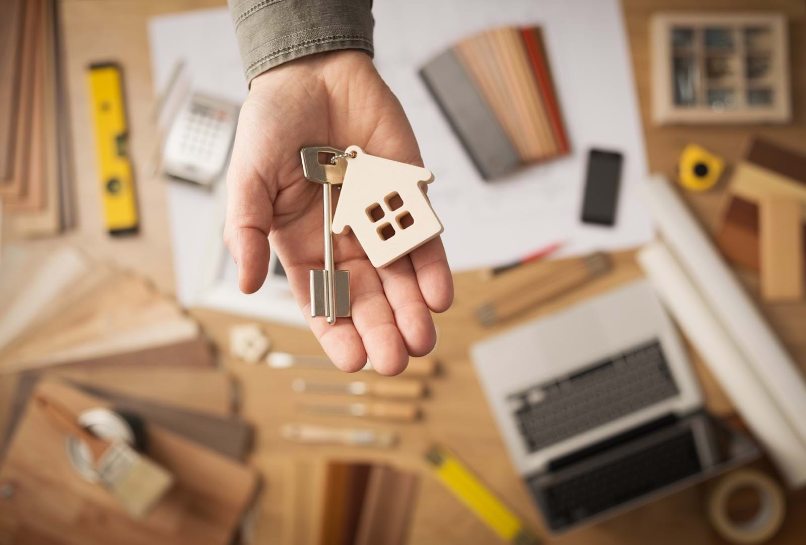

```{r setup, echo=FALSE, results='hide', message=FALSE, warning=FALSE}
knitr::opts_chunk$set(echo=FALSE, message=FALSE, warning=FALSE)

# Uvoz vseh potrebnih knjižnic
source("lib/libraries.r", encoding="UTF-8")
```

```{r rstudio, results='asis'}
# Izris povezave do RStudia na Binderju
source("lib/rstudio.r", encoding="UTF-8")
```

# Analiza stanovanjskih razmer v Sloveniji

V svoji analizi bom obravnavala pregled nedavne stanovanjske statisitke v Sloveniji, med letoma 2011 in 2019. Dostojno stanovanje po dostopni ceni in v varnem okolju je osnovna človekova potreba in po mnenju mnogih človekova pravica, izpolnjevanje te potrebe, ki bi verjetno ublažila revščino in socialno izključenost, je v številnih evropskih državah in prav tako v Sloveniji še vedno oteženo.

Vse podatke, ki sem jih uporabila sem dobila na [Statističnem uradu republike Slovenije](https://www.stat.si/StatWeb/).




***

# Obdelava, uvoz in čiščenje podatkov

```{r uvoz}
source("uvoz/uvoz.r", encoding="UTF-8")
```

Uvozila sem podatke o stanovanjskih razmerah v obliki CSV in html s statističnega urada. Podatke imam v sedmih razpredelnicah v obliki *tidy data*.

1. `regije` - podatki o tipu lastništva za vsako regijo
  - `regija` - spremenljivka: ime regije (neurejen faktor),
  - `tip lastništva` - spremenljivka: tip lastništva,
  - `leto` - spremenljivka (število),
  - `število prebivalcev` - meritev: število prebivalcev v pripadajoči regiji (število).

2. `regije` - podatki o vrstah stavbe za vsako regijo
  - `regija` - spremenljivka: ime regije (neurejen faktor),
  - `vrsta stavbe` - spremenljivka: vrsta stavbe,
  - `povprečje` - meritev: število prebivalcev v posameznih vrstah stanovanj v pripadajoči regiji (število).

3. `regije` - podatki o številu prebivalcev za vsako regijo
  - `regija` - spremenljivka: ime regije (neurejen faktor),
  - `povprečje` - meritev: število prebivalcev v pripadajoči regiji (število).
  
4. `cene` - podatki o cenovni preobremenjenosti glede na spol in starost
  - `starost` - spremenljivka: starost (neurejen faktor),
  - `spol` - spremenljivka: spol,
  - `leto` - spremenljivka (število),
  - `število prebivalcev` - meritev: število prebivalcev (število).

5. `kakovosti` - podatki o prenaseljenosti stanovanj glede na leto
  - `leto` - spremenljivka: leto,
  - `skupaj.x` - meritev: število prebivalcev Slovenije (število),
  - `skupaj.y` - meritev: število prebivalcev Slovenije, ki živijo v prenaseljenih stanovanjih (število),
  
6. `regije` - podatki o primanjkljaju za vsako regijo
  - `regija` - spremenljivka: ime regije (neurejen faktor),
  - `leto` - spremenljivka (število),
  - `primanjkljaji` - spremenljivka: primanjkljaj,
  - `delež gospodinjstev` - meritev: delež gospodinjstev v pripadajoči regiji (število).
  
7. `ocene` - podatki o samooceni splošnega zadovoljstva z življenjem
  - `spol` - spremenljivka: spol,
  - `ocena` - spremenljivka: samoocena (neurejen faktor),
  - `leto` - spremenljivka (število),
  - `število prebivalcev` - meritev: število ocenjenih (število).
  

***

# Analiza in vizualizacija podatkov

Stanovanjske razmere na številne načine vplivajo na kakovost življenja ljudi: zagotavljajo zatočišče, varnost, zasebnost ter prostor za sprostitev, učenje, delo in življenje. Financiranje nakupa ali najema stanovanja pa je pomembno vprašanje za številna gospodinjstva, ki je pogosto povezano s kakovostjo stanovanja. Zato se bom pri svoji analizi najbolj osredotočila na naslednja vprašanja:

 - V kakšnih vrstah stanovanj živijo prebivalci Slovenije
 - Koliko prebivalcev Slovenije ima v lasti stanovanje in koliko jih živi v najemniškem
 - Koliko prebivalcev Slovenije je preobremenjenih s stanovanjskimi stroški
 - Koliko prebivalcev Slovenije živi v prenaseljenih stanovanjih
 - Kakšna je kakovost stanovanj v Sloveniji
 
 
 
 
 
 
 
 
```{r vizualizacija, results='hide'}
source("vizualizacija/vizualizacija.r", encoding="UTF-8")
```


```{r echo=FALSE, message=FALSE, warning=FALSE,fig.align='center', fig.show = "hold", fig.width=12, fig.height=4}
 plot_grid(graf2, graf3)
```

Zgornja grafa nam prikazujeta povprečno število ljudi, ki živijo v eno, dvo ali večstanovanjskih stavbah v obdobju med 2011-2019, po regijah. Enostanovanjske stavbe so samostojno stoječe enodružinske hiše, vile, atrijske hiše, vrstne hiše, počitniške hiše in podobno. Dvo in večstanovanjske stavbe so samostojno stoječe stavbe z dvema ali več stanovanji, stanovanjski bloki, stolpiči, stolpnice in podobno. Največ slovencev živi v eno ali dvostanovanjskih hišah v Prekmurju in Spodnjeposavski regiji in to kar 80% vseh prebivalcev. V tro ali večstanovanjskih stavbah pa živi več kot 30% prebivalcev v zasavski, osrednjeslovenski in obalno-kraški regiji.

Iz teh dveh grafov je lepo razvidno, da večina prebivalcev Slovenije živi v eno ali dvostanovanjskih stavbah. Boljšo predstavo razmerja pa nam prikazuje spodnji tortni graf. Opazimo, da kar tri četrtine slovencev živi v samostoječih eno oziroma dvodružinskih hišah. 


```{r pie, echo=FALSE, fig.align='center'}
slices <- c(1358319, 520386) 
lbls <- c("Stanovanja v eno ali \ndvostanovanjskih stavbah", "Stanovanja v tro ali \nvečstanovanjskih stavbah")
pie3D(slices, labels=lbls, explode=0.1, 
               main="Razmerje med eno ali dvostanovanjsko stavbo \nter tro ali večstanovanjsko stavbo", 
               col=c("darkgoldenrod3", "cadetblue"))
```

Slovenci večinoma živimo v lastniških stanovanjih in smo v odstotkih lastniških stanovanj na prebivalca v samem vrhu v Evropski Uniji.
Iz grafa lahko tudi razberemo, da je najemniških stanovanj v Sloveniji zelo malo. V večini regij je stanovanj z drugimi tipi lastništva, kot so dijaški in študentski domovi ter socialna stanovanja celo več kot pa najemniških stanovanjih.

```{r graf_povprecja_po_regijah, echo=FALSE, fig.align='center'}
graf_povprecja_po_regijah
```

Pomemben kazalec kakovostnega stanovanja je tudi cena le-tega. Logično je, da je odstotek ljudi do 17 leta starosti nizek saj se domneva, da otroci še živijo pri starših in tako nimajo stroškov s stanovanjem. Najvišji procent ljudi preobremenjenih s stanovanskimi stroški je v skupini, kjer so stari od 17 do 64 let, saj so v tej skupini študenti in ljudje, ki so komaj vstopili na trg dela in imajo manj denarja ter jim zato stanovanje predstavlja velik strošek. V skupni ljudi, ki so stari nad 64 let pa je odstotek preobremenjenih ponovno nizek saj so si v mladosti stanovanjski problem že rešili. Zaradi preteklih nekaj let, ki so bila ekonomsko sorazmerno stabilna in ugodna se opazi tudi upad ljudi, ki so preobremenjeni s stanovanjskimi stroški. 


```{r graf_st.preobremenjenosti, echo=FALSE, fig.align='center'}
graf_st.preobremenjenosti
```


***

# Napredna analiza podatkov


```{r analiza}
source("analiza/analiza.r", encoding="UTF-8")
```

```{r graf7, echo=FALSE, fig.align='center'}
graf7
```

Zgornji graf nam prikazuje število oseb v prenaseljenih stanovanjih v primerjavi s številom prebivalcev v zadnjih desetih letih. Pri iskanju teh podatkov sem pričakovala konstantno ali pa rahlo naraščujočo krivuljo brez večjih nihanj, kajti pogosto preseljevanje ljudi ni značilno za Slovenijo, še posebej ne v tako kratkem obdobju. Navzdol obrnjena premica prikazuje, da se stanje v Sloveniji kljub naraščanju prebivalcev zmanjšuje, kar nakazuje na izboljšanje standarda življenja v Sloveniji. 

***

# Shiny


```{r shiny}
shinyAppDir("shiny", options=list(width="100%", height=600))
```

Shiny nam v prvem zavihku prikazuje delež gospodinjstev, ki živijo v prikrajšanih stanovanjih glede na posamezne regije. Večina teh gospodinjstev živi v stanovanjih, ki so slabega stanja. V regijah, na primer osrednjeslovenska, ima prav tako veliko ljudi težave s hrupom in onesnaženost okolja, katero močno vplivata na zdravje in učinkovito delo. Zasledila sem tudi, da je prisotnost kriminala precej nizka. V splošnem pa je opaziti da se delež gospodinjstev z elementi prikrajšanosti zmanjšuje v Sloveniji. 

V drugem zavihku je prikazana samoocena anketiranih prebivalcev Slovenije, ki je izhajala iz splošnega zadovoljstva z življenjem glede na stanovanjsko prikrajšanost. Resno stanovanjsko prikrajšane so osebe, katerih življenjski pogoji so močno omejeni zaradi omejenih finančnih virov gospodinjstva, in ne zaradi lastne izbire oz. navad. Gre za osebe, ki si ne morejo si privoščiti: rednega plačila hipoteke ali najemnine, rednih stanovanjskih stroškov, odplačevanja kreditov in primerno ogrevanega stanovanja. Ankentiranci so kakovost svojega življenja ocenjevali po lestivici od 0 do 10 in največ jih je ocenilo med 7 in 8.


***

# Zaključek

Glede na vse kazalnike, ki sem jih analizirala sem ugotovila, da je kakovost življenja v Sloveniji glede na stanovanjske razmere precej dobra in da se še izboljšuje. Večina ljudi ima v lasti svoje hiše, s kateremi niso cenovno močno preobremenjeni. Prav tako imamo veliko socialnih stanovanj. Med elementi prikrajšanosti stanovanj prednjači slabo stanje stanovanja, sledijo pa mu težave s hrupom, večina stanovanj pa je ustrezno ogrevana. V splošnem so državljani zadovoljni z življnenjem v državi na kar kažejo tudi visoke ocene zadovoljstva.